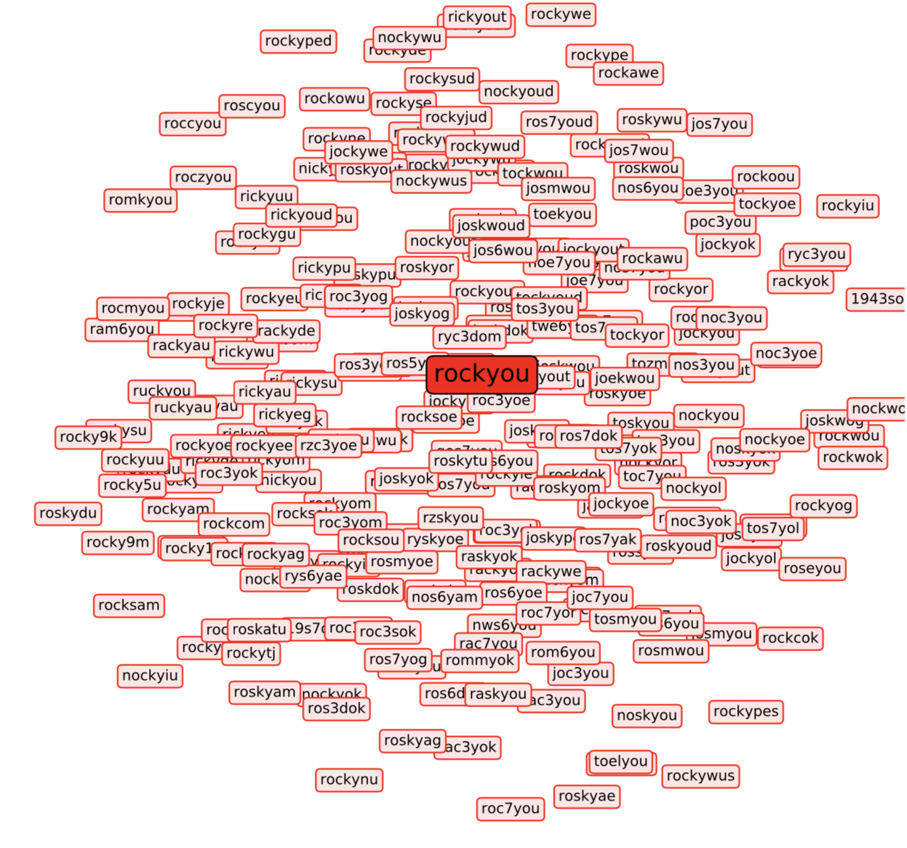

# Improving Password Guessing via Representation Learning

It is the official code repository for our paper.

**Title:** Improving Password Guessing via Representation Learning

**Authors:** [Dario Pasquini](https://www.researchgate.net/profile/Dario_Pasquini), [Ankit Gangwal](https://www.math.unipd.it/~gangwal/), [Giuseppe Ateniese](https://scholar.google.com/citations?hl=en&user=EyZJ08MAAAAJ), [Massimo Bernaschi](http://www.iac.rm.cnr.it/~massimo/Massimo_Bernaschi_home_page/Welcome.html), and [Mauro Conti](https://www.math.unipd.it/~conti/).

	

## Content:

### Pre-trained GAN generator

Directory *DATA/TFHUB_models* contains pretrained GAN generator models in [tensorflow hub](https://www.tensorflow.org/hub) format. You can play with them using the python notebook *sampleFromPassGAN.ipynb*.

### Scripts:
#### Generate passwords with the generator

Use the python script *generatePasswords.py* to generate password.

> USAGE: python3 generatePasswords.py NBATCH BATCHSIZE OUTPUTFILE

here:

* **NBATCH =** Number of passwords batches to generate
* **BATCHSIZE =** Number of passwords in a generated batch (bigger = faster; but depends from your GPU's memory )
* **OUTPUTFILE =** Path of the file where to write the generated passwords

An example:

> python3 generatePasswords.py 10000 4096 ./OUTPUT/out.txt

Dependencies:

* tensorflow (only 1.14.0 tested)
* tensorflow_hub
* numpy
* tqdm

#### Dynamic Password Guessing (DPG)

uploading soon ....

#### Substring Password Guessing (SPG)

uploading soon ....