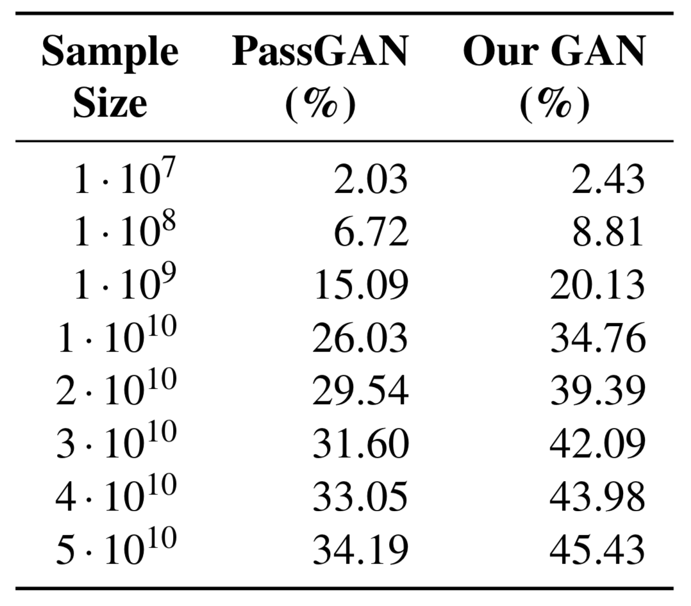

# Improving Password Guessing via Representation Learning

It is the official code repository for our paper.

**Title:** [Improving Password Guessing via Representation Learning](https://arxiv.org/abs/1910.04232)

**Authors:** [Dario Pasquini](https://www.researchgate.net/profile/Dario_Pasquini), [Ankit Gangwal](https://www.math.unipd.it/~gangwal/), [Giuseppe Ateniese](https://scholar.google.com/citations?hl=en&user=EyZJ08MAAAAJ), [Massimo Bernaschi](http://www.iac.rm.cnr.it/~massimo/Massimo_Bernaschi_home_page/Welcome.html), and [Mauro Conti](https://www.math.unipd.it/~conti/).

<p align="center">
	
</p>

### Related Guessing Attacks
* [Adaptive, Dynamic Mangling rules: **ADaMs** attack](https://github.com/TheAdamProject/adams)

## Content:

### Pre-trained GAN generator

Our basic GAN generator is an improved version of the one proposed in [PassGAN](https://arxiv.org/abs/1709.00440).  A comparison on the RockYou [test-set](https://arxiv.org/abs/1709.00440) follows:
<p align="center">
	
</p>

Directory *DATA/TFHUB_models* contains pretrained GAN generators and autoencoders in [tensorflow hub](https://www.tensorflow.org/hub) format. You can play with them using the python notebook *sampleFromPassGAN.ipynb* and *CPG_poc.ipynb* respectively.

The code for the training of the generator and the encoder will be uploaded soon.

### Scripts:
**Dependencies:**

- **tensorflow1** (only 1.14.0 tested)
- tensorflow_hub
- numpy
- tqdm
- [gin](https://github.com/google/gin-config) #pip install gin-config
- numpy_ringbuffer # pip install numpy_ringbuffer
- [peloton_bloomfilters](https://github.com/pelotoncycle/peloton_bloomfilters) from [Peloton](https://github.com/pelotoncycle) (in our repo, a modified version of the code aimed for py3)
  - *peloton_bloomfilters; pip install .* 

#### Generate passwords with the generator

Use the python script *generatePasswords.py* to **unconditionally** generate password.

> USAGE: python3 generatePasswords.py NBATCH BATCHSIZE OUTPUTFILE

here:

* **NBATCH =** Number of passwords batches to generate
* **BATCHSIZE =** Number of passwords in a generated batch (bigger = faster; but depends from your GPU's memory )
* **OUTPUTFILE =** Path of the file where to write the generated passwords

An example:

> python3 generatePasswords.py 10000 4096 ./OUTPUT/out.txt

#### Dynamic Password Guessing (DPG)

The script: *dynamicPG.py* is a proof-of-concept implementation of Dynamic Password Guessing. The script takes as input the set of attacked passwords (plaintext) and perform DPG on it. The generated passwords are then printed on a chosen output file. 

> USAGE: python3 dynamicPG.py CONF TEST-SET #GUESSES OUTPUTFILE

here:

- **CONF =** gin configuration file. An example of this can be found in *'./DATA/CONFINGS/DPG_default.gin'*. Here, you can choose the value for $\sigma$ and $\alpha$.
- **TEST-SET =** Path of the textual file containing the attacked passwords (plaintext). The file must contain a password per row.
- **GUESSES =** Number of passwords to produce.
- **OUTPUTFILE =** Path of the file where to write the generated passwords

An example:

> python3 dynamicPG.py DATA/CONFINGS/DPG_default.gin ~/zomato.txt 10000000 output.txt 

As reported in our paper, DPG is aimed to be applied on password leaks the follow distributions different from the one of the used training-set (our *a priori* knowledge). Additionally, it works particularly well when the attacked leak has large cardinality.

#### Conditional Password Guessing (CPG)

You can play with CPG using *CPG_poc.ipynb*.

# Training your own model

## GAN models

### Create a dataset

The code needed to train a GAN generator is located inside the directory *PasswordGAN*.

To train the generator, you need to create a training set first. You can do that by using the script *make_dataset.py*. Instructions:

*make_dataset.py* takes three arguments as input:

1. The first is the path to an txt file that contains the passwords you want to use to train the model. ⚠️ Every line of the file must be in the format: "[PASSWORD FREQUENCY] [PASSWORD]". For instance:

   ````
     49952 iloveyou
     33291 princess
     21725 1234567
     20901 rockyou
     20553 12345678
     16648 abc123
     ...........
   ````

   [Here an example file](http://downloads.skullsecurity.org/passwords/rockyou-withcount.txt.bz2)

2. The second parameter is the maximum length of the passwords to include in the training set (e.g., 10 or 16).

3. The third parameter is where to save the output file e.g, */home/user/dataset.pickle*

### Create a configuration file and train the model

Once created the dataset, you have to edit the config file in *PasswordGAN/CONF/arch1.gin*. In particular, you have to set the variables *setup.dataset_path* with the path to the dataset e.g., *setup.dataset_path = "/home/user/dataset.pickle"*.

Then, you can train the model by using the script *train.py* in PasswordGAN. The script takes as input the path to the config file e.g.,:

 ```
python train.py CONF/arch1.gin
 ```

The script saves logs (tensorboard) and checkpoints inside the folder "./PasswordGAN/HOME/CHECKPOINTS/".


## Autoencoder-based models

...


